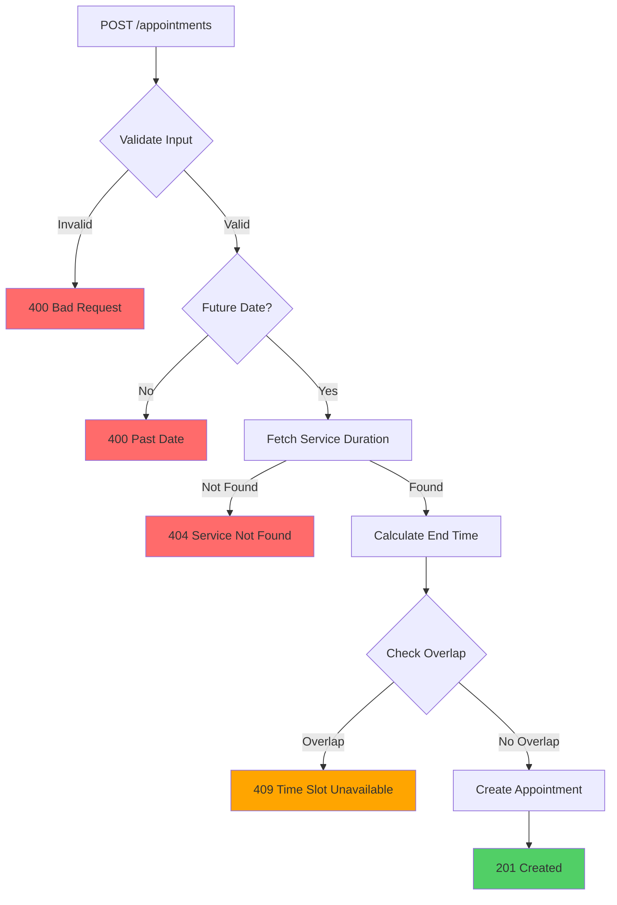

# Appointment Service Business Rules

## Overview
The appointment service implements comprehensive business logic to prevent scheduling conflicts and ensure data integrity.

---

## Business Rules Implemented

### 1. Future Date Validation ✅
**Rule:** All new appointments must be scheduled in the future.

```javascript
const startTime = new Date(appointment_at);
if (startTime <= new Date()) {
  throw ApiError.badRequest('Appointment time must be in the future');
}
```

### 2. Service Duration Lookup ✅
**Rule:** Automatically fetch service duration from the `services` table.

```javascript
const getServiceDuration = async (serviceId) => {
  const { data: service, error } = await supabase
    .from('services')
    .select('duration')
    .eq('id', serviceId)
    .single();

  if (error || !service) {
    throw ApiError.notFound('Service not found');
  }

  return service.duration; // in minutes
};
```

### 3. End Time Calculation ✅
**Rule:** Automatically calculate appointment end time based on service duration.

```javascript
const calculateEndTime = (startTime, durationMinutes) => {
  const start = new Date(startTime);
  const end = new Date(start.getTime() + durationMinutes * 60000);
  return end.toISOString();
};
```

**Example:**
- Appointment at: `2025-12-25T10:00:00Z`
- Service duration: `30 minutes`
- Calculated end time: `2025-12-25T10:30:00Z`

### 4. Overlap Prevention ✅
**Rule:** Prevent overlapping appointments for the same service.

**Overlap Logic:**
```
Overlap occurs if: (start1 < end2) AND (end1 > start2)
```

```javascript
const checkOverlap = async (serviceId, startTime, endTime, excludeAppointmentId = null) => {
  let query = supabase
    .from('appointments')
    .select('id, appointment_at, end_time')
    .eq('service_id', serviceId)
    .neq('status', 'cancelled'); // ✅ Ignore cancelled appointments

  // Check for time overlaps
  for (const apt of existingAppointments) {
    const existingStart = new Date(apt.appointment_at);
    const existingEnd = new Date(apt.end_time);

    if (startTime < existingEnd && endTime > existingStart) {
      return true; // Overlap found
    }
  }

  return false;
};
```

### 5. Soft Delete (Cancelled Status) ✅
**Rule:** DELETE endpoint does NOT remove rows, it updates status to 'cancelled'.

```javascript
const deleteAppointment = async (id) => {
  await getById(id); // Verify exists
  
  // Soft delete: update status instead of removing row
  const { error } = await supabase
    .from('appointments')
    .update({ status: 'cancelled' })
    .eq('id', id);
  
  if (error) {
    throw ApiError.internal('Failed to cancel appointment');
  }
};
```

**Benefits:**
- ✅ Preserves appointment history
- ✅ Allows reporting on cancelled appointments
- ✅ Can be restored if needed

### 6. Cancelled Appointments Excluded from Active Queries ✅
**Rule:** `GET /appointments` excludes cancelled appointments by default.

```javascript
const getAll = async () => {
  const { data, error } = await supabase
    .from('appointments')
    .select(/* ... */)
    .neq('status', 'cancelled') // ✅ Filter out cancelled
    .order('appointment_at', { ascending: true });
};
```

### 7. Cancelled Appointments Ignored in Overlap Checks ✅
**Rule:** Cancelled appointments do not block time slots.

```javascript
.neq('status', 'cancelled') // Exclude cancelled from overlap checks
```

### 6. Conflict Error Handling ✅
**Rule:** Throw `ApiError(409, "Time slot unavailable")` when overlaps detected.

```javascript
const hasOverlap = await checkOverlap(service_id, startTime, new Date(endTime));
if (hasOverlap) {
  throw ApiError.conflict('Time slot unavailable');
}
```

---

## API Endpoints

### GET `/api/v1/appointments`
Get all appointments with patient and service details.

**Response:**
```json
{
  "success": true,
  "data": [
    {
      "id": "uuid",
      "appointment_at": "2025-12-25T10:00:00Z",
      "end_time": "2025-12-25T10:30:00Z",
      "status": "scheduled",
      "notes": "First visit",
      "patients": {
        "id": "uuid",
        "name": "John Doe",
        "email": "john@example.com",
        "phone": "1234567890"
      },
      "services": {
        "id": "uuid",
        "name": "Dental Cleaning",
        "duration": 30,
        "price": 100
      }
    }
  ]
}
```

### POST `/api/v1/appointments`
Create new appointment.

**Request:**
```json
{
  "patient_id": "uuid",
  "service_id": "uuid",
  "appointment_at": "2025-12-25T10:00:00Z",
  "status": "scheduled",
  "notes": "First visit"
}
```

**Success Response (201):**
```json
{
  "success": true,
  "data": { /* appointment with calculated end_time */ }
}
```

**Error Responses:**
```json
// 400 - Past date
{
  "success": false,
  "message": "Appointment time must be in the future"
}

// 404 - Invalid service
{
  "success": false,
  "message": "Service not found"
}

// 409 - Time slot conflict
{
  "success": false,
  "message": "Time slot unavailable"
}
```

### PUT `/api/v1/appointments/:id`
Update appointment (with overlap re-checking).

**Request:** (all fields optional)
```json
{
  "appointment_at": "2025-12-25T14:00:00Z",
  "status": "confirmed"
}
```

### DELETE `/api/v1/appointments/:id`
Cancel appointment (soft delete - updates status to 'cancelled').

**Behavior:**
- Does NOT remove row from database
- Updates `status` to `'cancelled'`
- Preserves appointment history

**Success Response (200):**
```json
{
  "success": true,
  "message": "Appointment deleted successfully"
}
```

**Note:** Cancelled appointments:
- Are excluded from `GET /appointments` results
- Do not block time slots for new appointments
- Can still be retrieved individually by ID

---

## Validation Flow



---

## Example Scenarios

### Scenario 1: Successful Booking ✅
```
Service: Dental Cleaning (30 min)
Request: 2025-12-25 10:00 AM
Existing: None
Result: ✓ Booked (10:00 - 10:30)
```

### Scenario 2: Overlap Detected ❌
```
Service: Dental Cleaning (30 min)
Request: 2025-12-25 10:15 AM
Existing: 10:00 - 10:30 (scheduled)
Result: ✗ 409 Time slot unavailable
```

### Scenario 3: Cancelled Ignored ✅
```
Service: Dental Cleaning (30 min)
Request: 2025-12-25 10:00 AM
Existing: 10:00 - 10:30 (cancelled)
Result: ✓ Booked (cancelled doesn't block)
```

### Scenario 4: Past Date Rejected ❌
```
Request: 2023-01-15 10:00 AM
Current: 2025-12-21
Result: ✗ 400 Appointment time must be in the future
```

---

## Database Schema Requirements

The service expects these Supabase tables:

### `appointments`
```sql
- id (uuid, primary key)
- patient_id (uuid, foreign key)
- service_id (uuid, foreign key)
- appointment_at (timestamptz)
- end_time (timestamptz) -- Auto-calculated
- status (text) -- 'scheduled', 'confirmed', 'completed', 'cancelled'
- notes (text, nullable)
```

### `services`
```sql
- id (uuid, primary key)
- name (text)
- duration (integer) -- Minutes
- price (numeric)
```

### `patients`
```sql
- id (uuid, primary key)
- name (text)
- email (text)
- phone (text)
```

---

## Key Features

✅ **Automatic Duration Lookup** - No manual end time calculation  
✅ **Smart Overlap Detection** - Prevents double-booking  
✅ **Soft Delete** - Cancelled appointments preserved for history  
✅ **Active Query Filtering** - GET excludes cancelled by default  
✅ **Future Date Enforcement** - No backdated appointments  
✅ **Consistent Error Responses** - `{ success: false, message }`  
✅ **Full CRUD Support** - Create, Read, Update, Cancel
