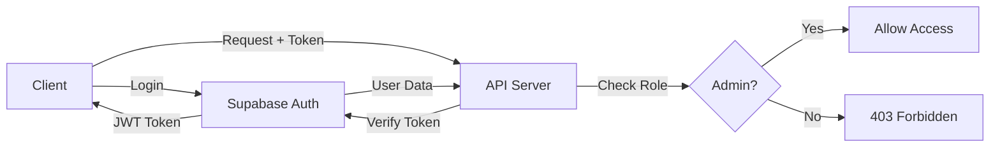

# Authentication & Authorization Guide

## Overview
The API uses Supabase JWT authentication with role-based access control. Admin users have full access, while regular users have read-only access to public endpoints.

---

## Authentication Flow

### How It Works

1. **Client logs in** via Supabase (frontend)
2. **Supabase returns JWT token**
3. **Client sends token** in Authorization header
4. **Server verifies token** using Supabase
5. **Server attaches user** to request
6. **Role checked** before allowing access



---

## Middleware

### 1. auth.middleware.js

**`authenticate`** - Require valid JWT token

```javascript
const { authenticate } = require('../middlewares/auth.middleware');

router.get('/protected', authenticate, controller.handler);
```

- Reads `Authorization: Bearer <token>` header
- Verifies token with Supabase
- Attaches `req.user` object
- Throws 401 if no token or invalid

**`req.user` object:**
```javascript
{
  id: "user-uuid",
  email: "user@example.com",
  role: "admin" | "user",
  metadata: { /* user_metadata from Supabase */ }
}
```

**`optionalAuth`** - Optional authentication

```javascript
const { optionalAuth } = require('../middlewares/auth.middleware');

router.get('/maybe-protected', optionalAuth, controller.handler);
```

- Same as `authenticate` but doesn't require token
- Sets `req.user = null` if no token

---

### 2. role.middleware.js

**`requireAdmin`** - Require admin role

```javascript
const { requireAdmin } = require('../middlewares/role.middleware');

router.post('/admin-only', authenticate, requireAdmin, controller.handler);
```

- Must use `authenticate` first
- Checks `req.user.role === 'admin'`
- Throws 403 if not admin

**`requireUser`** - Require any authenticated user

```javascript
const { requireUser } = require('../middlewares/role.middleware');

router.get('/user-data', authenticate, requireUser, controller.handler);
```

- Must use `authenticate` first
- Only checks if user is authenticated
- Allows any role

**`requireOwnerOrAdmin`** - Require resource owner or admin

```javascript
const { requireOwnerOrAdmin } = require('../middlewares/role.middleware');

router.get('/patients/:id', authenticate, requireOwnerOrAdmin('id', 'id'), controller.handler);
```

- Admin always allowed
- Regular users can only access their own resources
- Parameters: `(resourceIdParam, ownerField)`

**`adminOrReadOnly`** - Admin full access, users read-only

```javascript
const { adminOrReadOnly } = require('../middlewares/role.middleware');

router.use('/data', authenticate, adminOrReadOnly);
```

- Admin: all HTTP methods
- User: only GET requests

---

## Route Protection

### Current Implementation

| Resource | Endpoint | Auth Required | Role Required |
|----------|----------|---------------|---------------|
| Services | GET /services | ❌ No | Public |
| Services | GET /services/:id | ❌ No | Public |
| Services | POST/PUT/DELETE | ✅ Yes | Admin |
| Patients | All endpoints | ✅ Yes | Admin |
| Appointments | All endpoints | ✅ Yes | Admin |

### Public Endpoints (No Auth)

```
GET /api/v1/health
GET /api/v1/services
GET /api/v1/services/:id
```

### Protected Endpoints (Admin Only)

```
# Patients
GET    /api/v1/patients
GET    /api/v1/patients/:id
POST   /api/v1/patients
PUT    /api/v1/patients/:id
DELETE /api/v1/patients/:id

# Services
POST   /api/v1/services
PUT    /api/v1/services/:id
DELETE /api/v1/services/:id

# Appointments
GET    /api/v1/appointments
GET    /api/v1/appointments/:id
POST   /api/v1/appointments
PUT    /api/v1/appointments/:id
DELETE /api/v1/appointments/:id
```

---

## Usage Examples

### Frontend Login (React)

```javascript
import { createClient } from '@supabase/supabase-js';

const supabase = createClient(
  process.env.VITE_SUPABASE_URL,
  process.env.VITE_SUPABASE_ANON_KEY // Use ANON key on frontend!
);

// Login
const { data, error } = await supabase.auth.signInWithPassword({
  email: 'admin@tyradentistree.com',
  password: 'admin123',
});

const token = data.session.access_token;
```

### Making Authenticated Requests

```javascript
// Store token (localStorage, context, etc.)
const token = localStorage.getItem('access_token');

// Make authenticated request
const response = await fetch('http://localhost:3001/api/v1/patients', {
  headers: {
    'Authorization': `Bearer ${token}`,
    'Content-Type': 'application/json',
  },
});

const json = await response.json();
```

### With Axios

```javascript
import axios from 'axios';

const api = axios.create({
  baseURL: 'http://localhost:3001/api/v1',
});

// Add token to all requests
api.interceptors.request.use((config) => {
  const token = localStorage.getItem('access_token');
  if (token) {
    config.headers.Authorization = `Bearer ${token}`;
  }
  return config;
});

// Use it
const { data } = await api.get('/patients');
```

---

## Error Responses

All auth errors follow standard format:

### 401 Unauthorized

```json
{
  "success": false,
  "message": "No token provided"
}
```

```json
{
  "success": false,
  "message": "Invalid or expired token"
}
```

### 403 Forbidden

```json
{
  "success": false,
  "message": "Admin access required"
}
```

```json
{
  "success": false,
  "message": "Read-only access"
}
```

---

## Setting User Roles

Roles are stored in Supabase user metadata. Set them when creating users:

### Supabase Dashboard

1. Go to Authentication → Users
2. Select user
3. Edit user metadata
4. Add: `{ "role": "admin" }`

### Supabase Admin API (Server-side)

```javascript
const { data, error } = await supabase.auth.admin.updateUserById(
  userId,
  {
    user_metadata: { role: 'admin' }
  }
);
```

### Default Role

If no role is set, defaults to `'user'`.

---

## Security Best Practices

### ✅ DO

- Use ANON key on frontend
- Use SERVICE ROLE key only on backend
- Send tokens via Authorization header
- Store tokens securely (httpOnly cookies or secure storage)
- Validate tokens server-side for every protected request
- Use HTTPS in production

### ❌ DON'T

- Expose service role key to frontend
- Store tokens in localStorage (XSS vulnerable)
- Trust client-side role claims
- Skip token verification
- Use HTTP in production

---

## Testing Authentication

### 1. Get Token (Supabase CLI or Dashboard)

```bash
# Using Supabase CLI
supabase db seed
```

Or use your frontend login.

### 2. Test Unauthed Request (Should Fail)

```bash
curl -X POST http://localhost:3001/api/v1/patients \
  -H "Content-Type: application/json" \
  -d '{"name":"John","email":"john@test.com","phone":"1234567890"}'
```

**Expected:**
```json
{
  "success": false,
  "message": "No token provided"
}
```

### 3. Test Authed Request (Should Succeed)

```bash
curl -X POST http://localhost:3001/api/v1/patients \
  -H "Content-Type: application/json" \
  -H "Authorization: Bearer YOUR_JWT_TOKEN" \
  -d '{"name":"John","email":"john@test.com","phone":"1234567890"}'
```

**Expected (if admin):**
```json
{
  "success": true,
  "data": { /* created patient */ }
}
```

### 4. Test Non-Admin (Should Get 403)

```bash
curl -X POST http://localhost:3001/api/v1/patients \
  -H "Authorization: Bearer USER_TOKEN" \
  -H "Content-Type: application/json" \
  -d '{"name":"Test","email":"test@test.com","phone":"1234567890"}'
```

**Expected:**
```json
{
  "success": false,
  "message": "Admin access required"
}
```

---

## Database Security (Row Level Security)

Since we're using service role key, we bypass RLS. Implement your own access control in controllers if needed:

```javascript
const getPatients = async (req, res, next) => {
  try {
    // Example: users can only see their own patient record
    const { role, id } = req.user;
    
    let query;
    if (role === 'admin') {
      query = patientService.getAll();
    } else {
      query = patientService.getById(id);
    }
    
    const patients = await query;
    res.json({ success: true, data: patients });
  } catch (error) {
    next(error);
  }
};
```

---

## Quick Reference

### Middleware Chain Examples

```javascript
// Public endpoint
router.get('/services', serviceController.getAll);

// Admin only
router.post('/patients', authenticate, requireAdmin, patientController.create);

// Authenticated users
router.get('/profile', authenticate, requireUser, profileController.get);

// Owner or admin
router.get('/patients/:id', authenticate, requireOwnerOrAdmin('id'), patientController.getById);

// Optional auth
router.get('/public', optionalAuth, publicController.handler);
```

### Accessing User in Controller

```javascript
const createAppointment = async (req, res, next) => {
  try {
    const { id, email, role } = req.user;
    
    // Use user data as needed
    const appointment = await appointmentService.create({
      ...req.body,
      created_by: id,
    });
    
    res.status(201).json({ success: true, data: appointment });
  } catch (error) {
    next(error);
  }
};
```

---

## Troubleshooting

**Token not working?**
- Check `Authorization: Bearer <token>` format
- Verify token isn't expired
- Ensure using correct Supabase project

**403 Forbidden?**
- Check user role in Supabase dashboard
- Verify `user_metadata.role === 'admin'`
- Ensure middleware order is correct

**401 Unauthorized?**
- Check token is being sent
- Verify token is valid
- Check Supabase project URL/keys match
